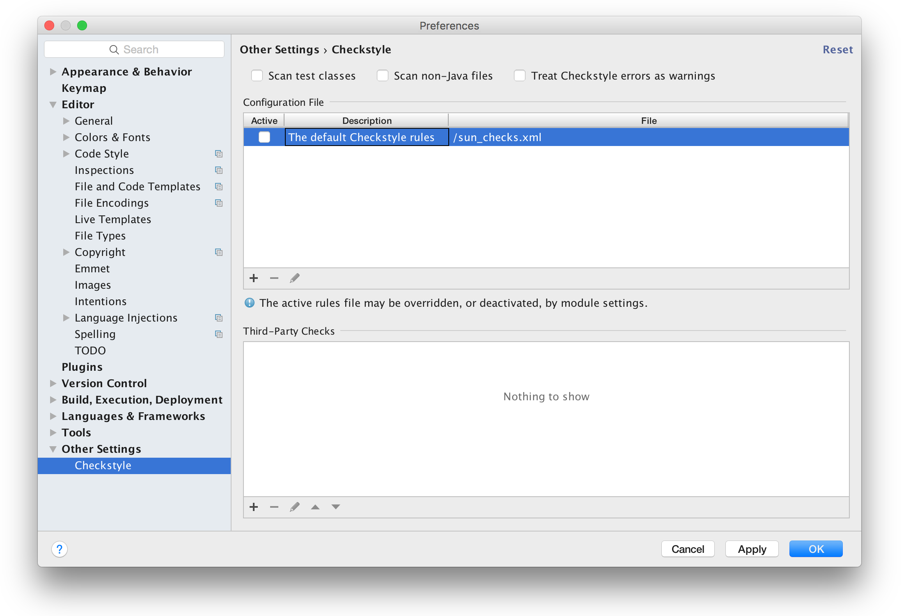
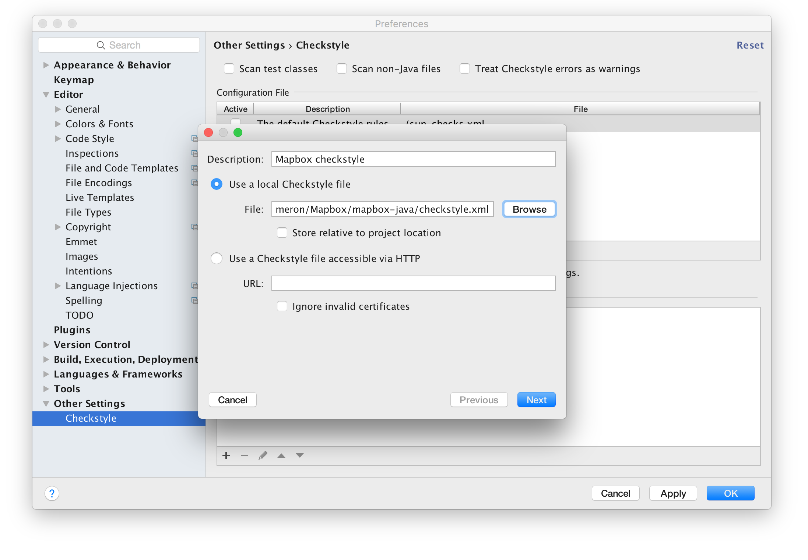
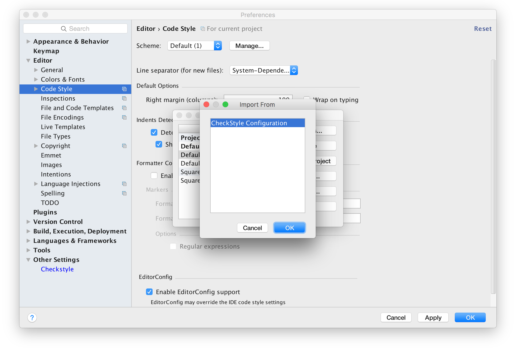
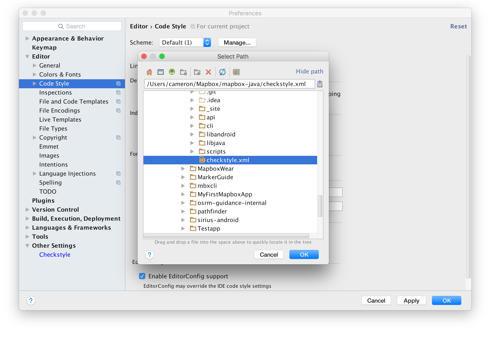

## 1. Get the plugin for Android Studio
Adding this plugin provides real-time feedback against a given CheckStyle profile by way of an inspection. to add, grab the [Checkstyle-idea plugin](https://github.com/jshiell/checkstyle-idea), install and restart Studio.

You can install the plugin from within Android Studio by opening the <kbd>Preferences</kbd>, selecting <kbd>Plugins</kbd> in the sidebar, and clicking on <kbd>Browse repositories…</kbd>. Search for <kbd>CheckStyle-IDEA</kbd>, install and restart Android Studio.

## 2. Add the projects checkstyle
Open <kbd>Preferences</kbd> in Android Studio and navigate to <kbd>Other Settings</kbd>. Add the checkstyle by pressing the plus button:

and grabbing the `checkstyle.xml` file found in the cloned repo:

Give a description click next and then finish:

Make sure to check the new style to actually apply it in Android Studio. Last thing I do (but is an optional) is to check the `Treat Checkstyle errors as warnings`.

## 3. Change the project code style
To make the formatting quick and easy, you'll most likely want to change the code style set in Android studio. Open `Preferences..` in Android Studio if it isn't open already and select `Editor -> Code Style` at the top under `Scheme` click the manage button:

Chose either project (to change the project style only) default, or make a new on. Click import and add the `checkstyle.xml` file:

Ensure that the style you imported the checkstyle to is selected in the dropdown menu now and click apply. Now when you are in a java file, all you have to do is press `[command][option][l]` (on Mac) and the file indentions and other formatting mistakes. 