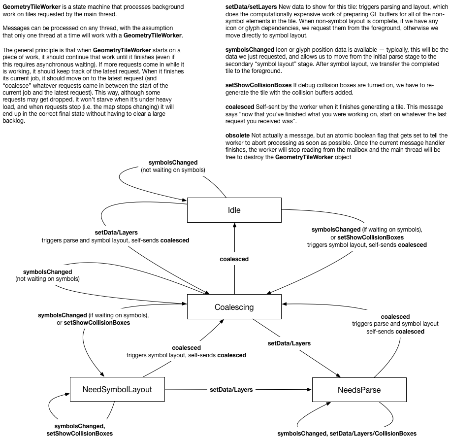

(this article is mostly a stub)

Mapbox GL's threading structure is built around the concept of message passing. In GL JS, this is enforced by the WebWorker interface, while in gl-native we implement message passing using the `Actor` interface. In GL JS efficient transfer between threads requires serializing to raw `TypedArray`s, while in native we can simply transfer ownership of pointers. The relative difficulty of transferring ownership on the JS side leads to some architectural compromises (for instance, on native, any worker thread can pick up work on a tile, whereas on the JS side tiles are coupled to individual workers in order to hold onto intermediate state). Native also takes advantage of the `Immutable` pattern to allow read-only sharing between threads.

All versions of GL have a pool of "workers" that are primarily responsible for background tile generation, along with a "render" thread that continually renders the current state of the map using whatever tiles are currently available. On JS and iOS, the render thread is the same as the foreground/UI thread. For performance reasons, the Android render thread is separated from the UI thread -- changes to the map made on the UI thread are batched and sent to the render thread for processing. The platforms also introduce worker threads for various platform-specific tasks (for instance, running HTTP requests in the background), but in general the core code is agnostic about where those tasks get performed: it sends a request and runs a callback when it gets a response. The platform implementations of `CustomGeometrySource` currently run their own worker pools, but I think we should probably get rid of them: https://github.com/mapbox/mapbox-gl-native/issues/11895.

Each platform is required to provide its own implementation of concurrency/threading primitives for gl-core to use. The platform code outside of core is also free to use its own threading model (for instance, the iOS SDK uses Grand Central Dispatch for running asynchronous tasks).

## Geometry Tile Worker

